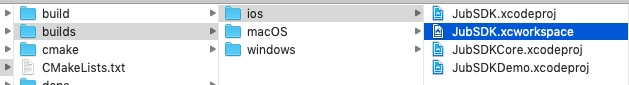
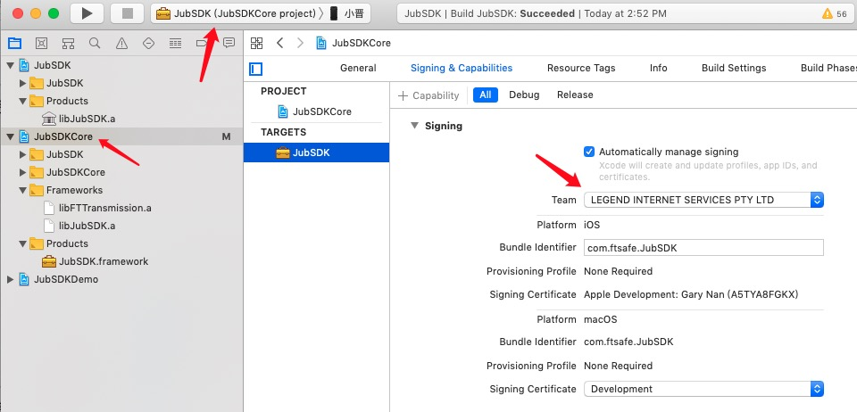
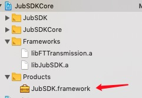

# HardWalletSDK

HDWallet for JUB


## iOS 打包配置

克隆本项目后，终端进入根目录，执行以下命令：
```
cd deps && git clone https://github.com/nlohmann/json.git
```


安装 **cmake**:
`brew install cmake`

安装 **hidapi**:
`brew install hidapi`

切换到 **HardWalletSDK** 根目录，执行 `mkdir build & cd build & cmake ..`

---

打开 Xcode 项目，如下图所示：


按下图所示，选好公司证书：

然后在真机和模拟器上各编译一次，
`Show in Finder` 打开编译好的 **JubSDK.framework** 目录。


然后在桌面上新建个文件夹命名 **HDWalletSDK**，分别将上面真机和模拟器编译的 **Release-iphoneos** 和 **Release-iphonesimulator** 文件夹拷贝放入 **HDWalletSDK** 目录下；然后执行以下合并命令：

```
lipo -create Release-iphoneos/JubSDK.framework/JubSDK Release-iphonesimulator/JubSDK.framework/JubSDK -output JubSDK
```
若无意外，此时在  **JubSDK** 文件夹下便会生成 合并后的 **JubSDK**，格式是 `exec 可执行文件` 。
将此文件拷贝到此目录下 **Release-iphoneos/JubSDK.framework/JubSDK** ，点击替换。

然后返回上一级目录将 **JubSDK.framework** 拷贝到项目中并替换。

>确保在项目 Target - General - Libraries 里的 JubSDK.framework 是 Embed & Sign 选项。